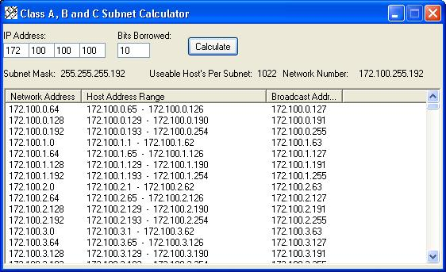



## IP Subnet Calculator Update

### Description

This is an update to my previous code submission. This one will calculate Class A, B and C addresses. I would like to thank flipmode for informing me that it is the last ip and not the first that is the network number. It takes a while to calculate Class A addresses since they are so large. So if you are calculating a Class A and it stops responding just let it go for a while and it will probably catch up. I also ran out of memory trying to calculate a Class A address so you might want to watch out there to. I appreciate comments so I can improve my work. Thank's
 
### More Info
 

             |
---                |---
**Submitted On**   |2002-02-14 17:35:20
**By**             |[Element\-X Software Productions](https://github.com/Planet-Source-Code/PSCIndex/blob/master/ByAuthor/element-x-software-productions.md)
**Level**          |Intermediate
**User Rating**    |4.8 (19 globes from 4 users)
**Compatibility**  |VB 6\.0
**Category**       |[Miscellaneous](https://github.com/Planet-Source-Code/PSCIndex/blob/master/ByCategory/miscellaneous__1-1.md)
**World**          |[Visual Basic](https://github.com/Planet-Source-Code/PSCIndex/blob/master/ByWorld/visual-basic.md)
**Archive File**   |[IP\_Subnet\_553302142002\.zip](https://github.com/Planet-Source-Code/element-x-software-productions-ip-subnet-calculator-update__1-31805/archive/master.zip)

